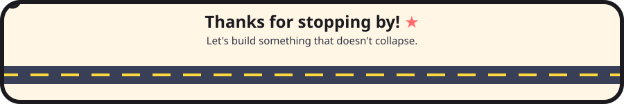

<div align="center">

<br/>


[](https://github.com/Mohammad-Abdelkhaleq?tab=followers)


</div>

---

```js
const mohammad = {
  role:      "Full-Stack Web Developer",
  frontend:  ["Angular", "React", "TypeScript", "JavaScript"],
  backend:   ["Node.js", "Express", "PostgreSQL"],
  currently: "shipping side projects at questionable hours",
  motto:     "it works on my machine 🤷",
};
```

> I like the part where an empty file turns into something people actually use.
> *(Fun fact: I got here from civil engineering. Different blueprints, same coffee habit.)*

---

## 🎒 Inventory

<div align="center">

**🎨 Front-end loadout**


**⚙️ Back-end loadout**


**🔧 Everyday carry**


</div>

<div align="center">


</div>

---

## 🚀 Now Playing

| 🎮 Project | What it is | Status |
|---|---|---|
| [**gym-rats-kit**](https://github.com/Mohammad-Abdelkhaleq/gym-rats-kit) | My corner of the internet, in TypeScript | 🟡 in progress |

---

## 🐍 Watch My Commits Get Eaten

<div align="center">

<picture>
  <source media="(prefers-color-scheme: dark)" srcset="https://raw.githubusercontent.com/Mohammad-Abdelkhaleq/Mohammad-AbdelKhaleq/output/snake-dark.svg">
  <source media="(prefers-color-scheme: light)" srcset="https://raw.githubusercontent.com/Mohammad-Abdelkhaleq/Mohammad-AbdelKhaleq/output/snake.svg">
  
</picture>
</div>

---

## 📬 Say Hi!

<div align="center">

[](https://github.com/Mohammad-Abdelkhaleq)
[](https://www.linkedin.com/in/)
[](mailto:7nkaleesgpt@gmail.com)

<br/>



</div>